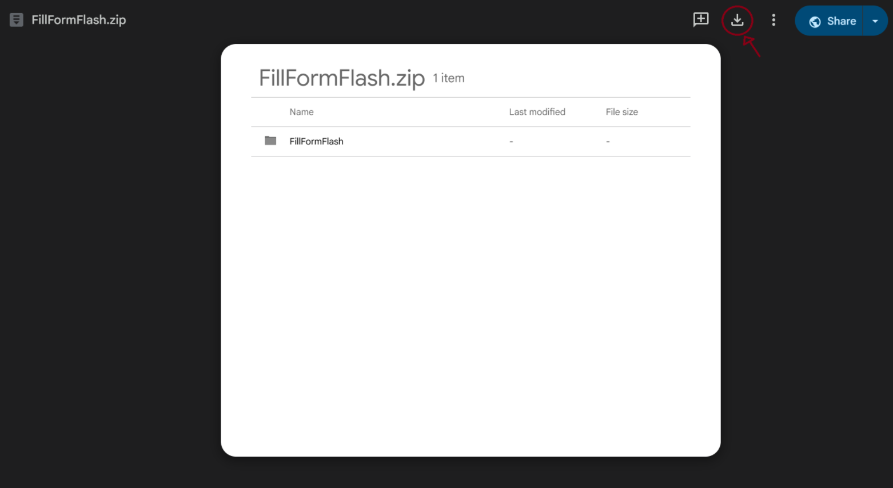
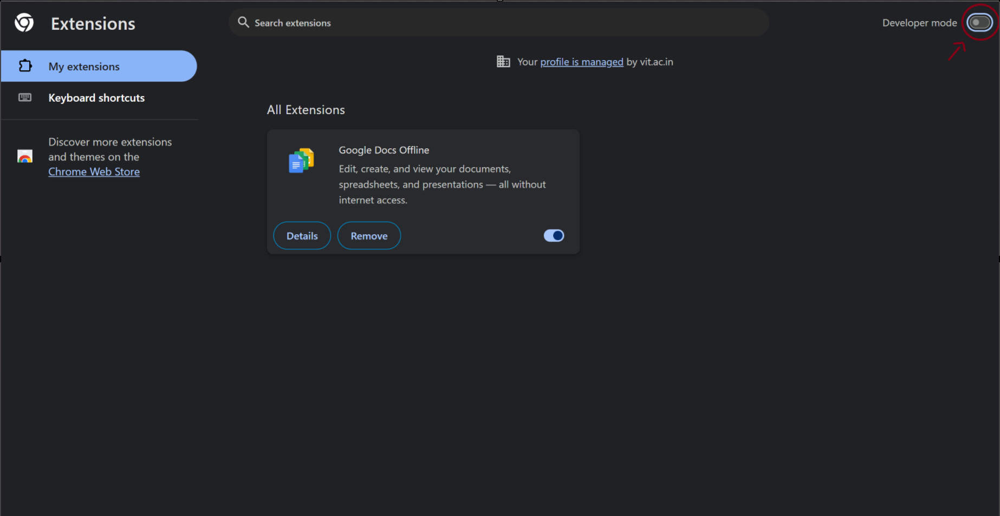
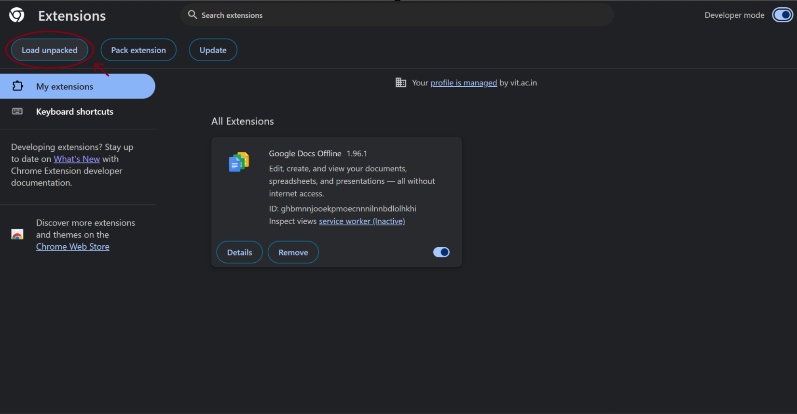
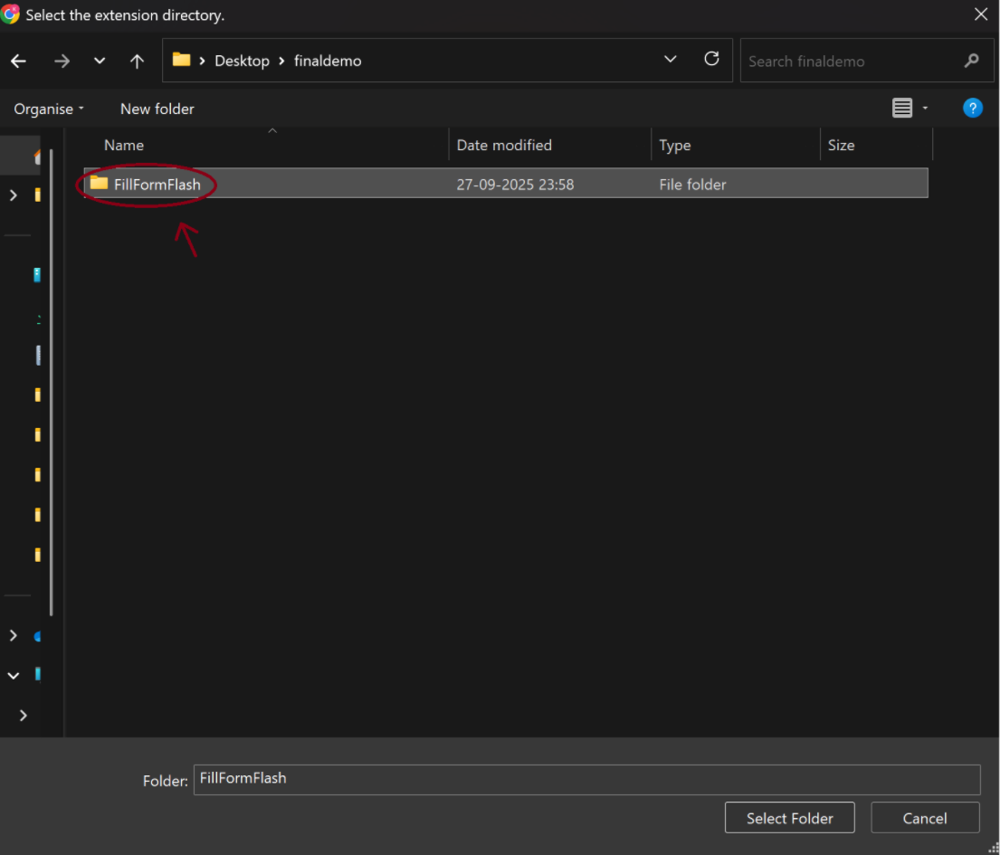
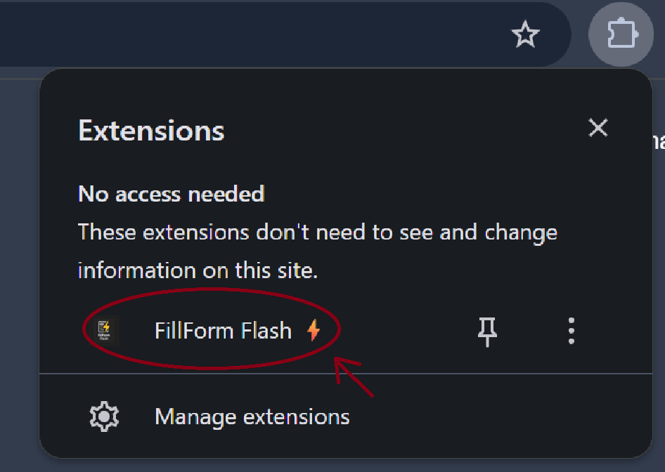

# ⚡ FillForm Flash

**FillForm Flash** is your ultimate **form filling browser extension**, designed to save time and automate repetitive tasks across multiple browsers. Lightning fast, easy to use, and highly customizable!  

---

## 🌐 Website
Check out the live website: [FillForm Flash Official](https://yourwebsite.com)

---

## 📥 Download
Click the button to download the extension:

[⬇️ Download FillForm Flash](https://drive.google.com/file/d/1t7QCJLWCaij_GlBrJ-ko-yV15hXWGXNv/view?usp=sharing)

---

## 🎬 Visual Guide

Watch directly on YouTube:  

---

## 🛠 Installation Steps
Follow these steps to install FillForm Flash in your browser (works for Chrome, Edge, Brave, Opera):

1. **Download & Extract:**  [***Link***](https://drive.google.com/file/d/1t7QCJLWCaij_GlBrJ-ko-yV15hXWGXNv/view?usp=sharing)  
   Download the extension ZIP file and extract it to a folder on your computer. 
     

2. **Open Extensions Page**  
   Open your browser and navigate to the extensions page:  
   - Chrome/Brave/Opera: `chrome://extensions/`  
   - Edge: `edge://extensions/`  

3. **Enable Developer Mode**  
   Use the toggle (usually top-right) to enable **Developer Mode**.  
     

4. **Load the Extension**  
   Click **Load unpacked** and select the extracted **FillForm Flash** folder.  
    
   

---

## 🚀 Usage Guide
5. **Data Input**  
   Click the FillForm Flash icon ⚡ in your toolbar. Enter your data or upload a `JSON` file, then press **Save**.
      

6. **Customization**  
   Use **Advanced Settings** to map fields, add synonyms, or **Wipe Data**. 

7. **Auto-Fill**  
   On Google/Microsoft Forms, click **Auto-Fill** to instantly populate fields.

---

## 🎨 Features
- Multi-browser support (Chrome, Edge, Brave, Opera, Vivaldi)  
- Auto-fill forms with JSON data  
- Advanced field mapping and synonyms  
- Lightning fast performance  
- Clean, modern interface  

---

## 📧 Contact
Questions or feedback? Reach out via email:  
[✉️ kishansg32@gmail.com](mailto:kishansg32@gmail.com)

---

## 📄 License
MIT License © 2025 FillForm Flash

---

